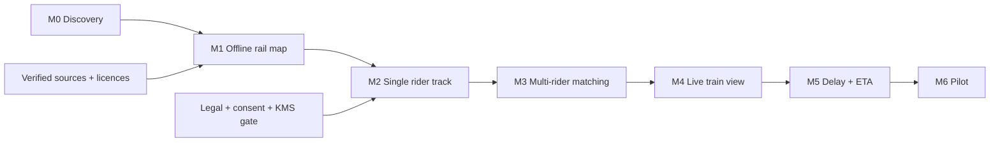

# TrainRadar MVP Plan

- Status: Approved
- Approved scope: M0–M6 roadmap; execution currently authorized only for M0
- Corridor: Москва-Павелецкая → Узуново, exactly 44 passenger stop points
- Planned exception: `Котляково` remains registry slot 8 but is disabled until commissioning
  evidence and separate owner approval
- Last updated: 2026-07-28

## Fixed decisions

Flutter iOS/Android; Go modular monolith; operational PostgreSQL/PostGIS plus separate encrypted
raw-GPS store; REST + SSE; Russia-only accountless invite pilot 5–15; owner as individual PD
operator; foreground plus separate active-trip background opt-in; exact raw GPS ≤24h then hard
delete/key destruction; `crowd_confirmed` ≥3 independent install-capability; Tutu manual point-check
only; versioned OSM/ODbL; no production public OSM tiles; four non-mixed truth states. M1 alone is
public and read-only; M2–M6 remain the invite-only pilot.

## Global invariants

1. Registry remains 44/44. Operational graph/map/stop patterns use 43 current points while
   `Котляково` is `planned_unused`; activation requires commissioning evidence and owner approval.
2. Registry is not a trip stop pattern; only `scheduled_stop`, `pass_through`, `conditional`,
   `cancelled`.
3. No estimated/stale/unknown data in live coverage.
4. Public train position is not passenger position.
5. Source, timestamp, age, confidence and algorithm/data version survive end-to-end.
6. No external data import without manifest, rights, snapshot version and checksum.
7. Automated PASS never substitutes physical-device, actual-GPS or target-user evidence.

## Milestone dependency graph

## M0 — Discovery and startup package

### User outcome

Владелец видит проверяемую архитектуру, источник неизвестностей и рабочий skeleton без ложных
real-time claims; planned `Котляково` остаётся fail-closed.

### In scope

- required docs/ADRs/research/evidence tree;
- seed registry and manifest;
- validators for 44/44, endpoints, special stops, state enum and branch exclusions;
- Flutter, Go, OpenAPI and dual-store Compose skeletons;
- architecture, privacy, risk, QA and test contracts.

### Out of scope

Schedule/OSM import, map, permissions/GPS, matching, grouping, SSE stream, ETA, deployment.

### Acceptance

- `make check` and `git diff --check` pass;
- git initialized, no commit;
- exact single `next_action`;
- all unverified external values `pending`;
- physical iOS/Android/GPS checks `NOT_RUN`;
- `docs/evidence/M0-startup.md` records results.

### Rollback/degradation

No external data exists to roll back. Skeleton reports realtime as 501 and registry as pending.

## M1 — Offline rail map + cached public schedule

### User outcome

Любой пользователь видит текущий 43-stop usable corridor from reproducible offline OSM data;
плановое расписание доступно online через Яндекс.Расписания API с коротким cache. Planned
`Котляково` не участвует в routing или coverage.

### Inputs

Verified 44-slot registry with 43 current usable stops, versioned OSM extract, provider/render
decision и Яндекс.Расписания API key в server-side secret store. Расписание не является snapshot:
оно доступно только при сети через cache-only adapter.

### Work

- cache-only Яндекс adapter с mandatory attribution и без persistent schedule storage;
- PostGIS rail graph with stations/platforms/tariff/technical objects separated;
- Flutter MapLibre offline/dev map;
- stop-pattern fixtures for sourced ordinary/accelerated/express trips.

### Acceptance

- 44/44 registry slots accounted for; 43 current stops in operational graph/map/QA;
- `Котляково` excluded from routing, stop patterns and coverage until its activation gate passes;
- topology has no forbidden branches;
- exact OSM attribution and extract checksum/version;
- карта works with network disabled after approved packaging; расписание при этом явно unavailable,
  а не выдаётся из cache;
- schedule cache не пишет на диск, живёт не более 300 секунд и не содержит API key в клиенте;
- source reviewer checks `32 км`/`85 км`.

### Rollback/degradation

Serve previous valid OSM version; disable changed layer on checksum/topology failure. При network/API
failure скрыть расписание с явным состоянием unavailable, не подменяя его stale snapshot.

## M2 — Single rider track

### User outcome

Один participant can start/stop an active trip and see only their own local track.

### Inputs/gates

Legal/operator review, consent copy, invite capability, Russian KMS/hosting, delete/backup design,
physical test devices.

### Work

- foreground consent and separate background opt-in state machine;
- synthetic/on-device observation capture;
- envelope encryption to raw store;
- raw deletion/key destruction;
- own local trip view; no public confirmed train.

### Acceptance

Synthetic/replay tests, server retention integration, revocation, logs redaction, physical iOS and
Android runs, battery baseline. A single rider never creates `crowd_confirmed`.

### Rollback/degradation

Remote upload feature flag off; local-only trip; delete pending uploads.

## M3 — Multi-rider matching

### User outcome

Independent observations are safely grouped into a trip without exposing participants.

### Work

Candidate trips from schedule, route-constrained matching, capability independence, replay/spoof/
outlier filtering, versioned derived tracks and incident candidates.

### Acceptance

- `crowd_confirmed` only with ≥3 independent capabilities;
- synthetic hostile tests produce zero false confirmations at approved test thresholds;
- ambiguous parallel-track data stays unmatched;
- individual contributors absent from public projection/logs.

### Rollback/degradation

All under-threshold/ambiguous results become `estimated` or unavailable; no optimistic carryover.

## M4 — Live train view

### User outcome

Passenger sees public aggregate state, freshness/confidence and source transitions through SSE.

### Work

REST snapshots, SSE projection/replay/heartbeat, mobile reconnect, truth-state UI, offline/stale and
source-conflict behavior.

### Acceptance

Contract and reconnect/backpressure tests; source/age/confidence end-to-end; accessibility;
participant comprehension of four states; no individual track endpoint.

### Rollback/degradation

REST snapshot only, persistent stale/offline label, live coverage disabled.

## M5 — Delay and ETA

### User outcome

Passenger sees checkpoint delay and ETA range with model version and confidence.

### Work

Schedule-only baseline, segment runtime statistics, interval prediction, evaluation pipeline,
unplanned-stop logic.

### Acceptance

Chronological holdout; p50/p90/p95 MAE and interval coverage; station arrival precision/recall;
degradation set; comparison to schedule-only; no point estimate without interval.

### Rollback/degradation

Schedule-only range labelled `estimated`, then unavailable beyond horizon.

## M6 — Invite-only pilot

### User outcome

5–15 invited participants safely use corridor view with monitored reliability and privacy controls.

### Work

Notifications, operational dashboards, consent/revocation, incident runbook, deletion audit,
field protocol and pilot stop criteria.

### Acceptance

Physical corridor evidence, battery and crash-free metrics, deletion/KMS drill, privacy/security
review, false-confirmation/incident metrics and owner sign-off.

### Rollback/degradation

Revoke invites, stop ingestion, destroy outstanding keys, switch to read-only/offline data.

## Execution rule

Only the milestone named in `docs/EXECUTION_STATE.yaml` may be executed. Finishing M0 does not
authorize M1. A milestone transition requires owner approval and a new single `next_action`.
