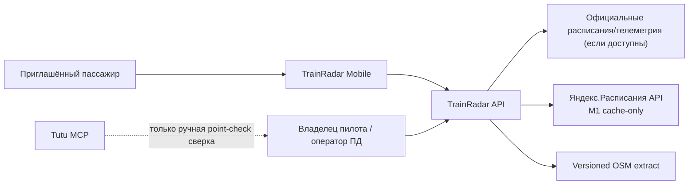
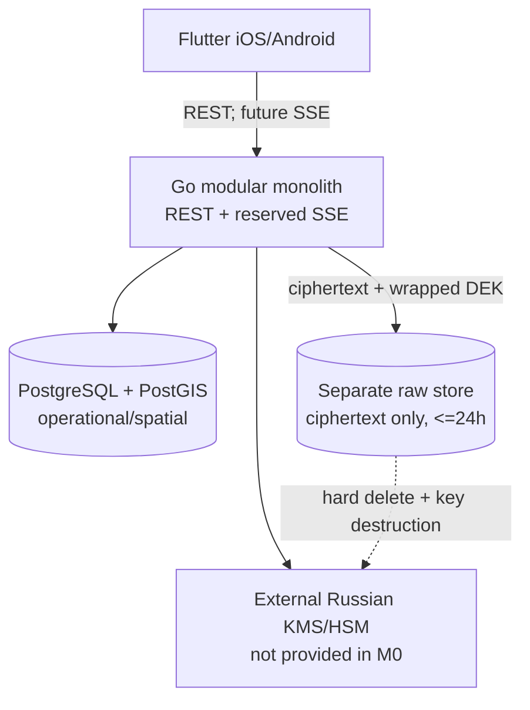
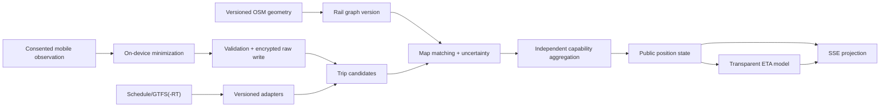
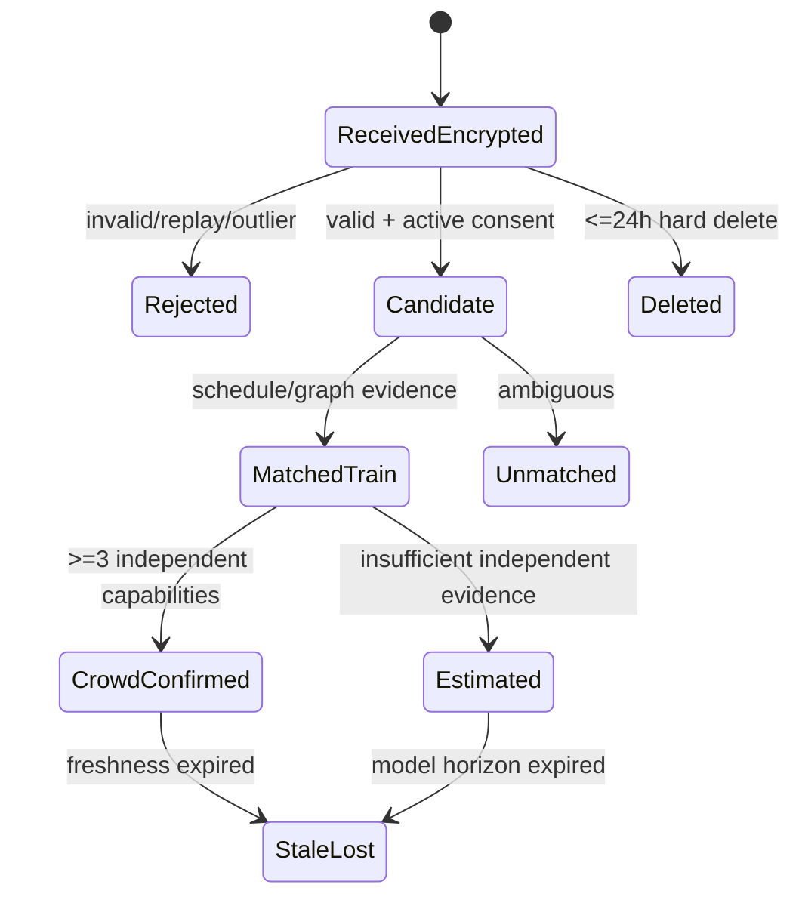

# Architecture

## Shape

Go modular monolith обслуживает REST и будущий SSE. Модули разделены доменными интерфейсами,
но разворачиваются одним процессом, пока измерения не докажут необходимость выделения сервисов.
Flutter — единственный клиент MVP. Redis, ClickHouse, Python/ML и web не добавляются.

## C4 Context

## C4 Containers

В M0 API не подключён к БД и SSE отвечает `501`. M1-02b добавляет локальный internal adapter
`backend/internal/schedule/yandex`: ключ читается только из environment backend-процесса
`YANDEX_RASP_API_KEY`; без ключа он возвращает safe `unavailable` без fake data. Реальный upstream
клиент — внедряемый интерфейс, поэтому adapter не открывает сеть сам и unit-тесты детерминированы.
Единственный cache находится в памяти процесса, защищён mutex, живёт от положительного TTL до 300
секунд включительно, не имеет refresh job и не отдаёт expired/stale response. Его internal output
содержит Yandex attribution, source timestamp и cache metadata, но не credential. Нет файловой
persistence, schedule snapshot, БД-кэша или offline serving. Compose проверяет только изоляцию dev
stores. Локальный volume сам по себе не является production encryption-at-rest.

M1-02b mobile map — встроенная Flutter offline-схема из компактной derived projection, а не новый
HTTP endpoint и не tile client. Она показывает только последовательность 43 enabled current stops,
явно помечает `Котляково` как disabled planned slot и не имеет network fetch, accounts, GPS,
train position, ETA или schedule surface. Versioned raw PBF остаётся в `data/runtime/` вне Git;
map asset хранит только необходимую для read-only display проекцию, version и ODbL attribution.

## Модули backend

- `corridor`: registry, rail graph versions, stop patterns;
- `schedule`: source adapters, trips, service dates;
- `observation`: consented immutable inputs and validation;
- `matching`: future candidate generation and train grouping;
- `position`: public truth state and freshness;
- `prediction`: future delay/ETA;
- `privacy`: retention, deletion, access audit;
- `httpapi`: REST/SSE transport;
- `observability`: logs, metrics, traces without exact coordinates.

M0 реализует только transport shell, truth-state primitives и raw-retention policy.

## Future data flow (не реализован)

Точная точка пассажира не проходит в public projection.

## Observation lifecycle (не реализован)

## Planned map matching

Для M2/M3 планируется воспроизводимый HMM/route-constrained matcher: candidate rail segments из
versioned PostGIS graph, emission score по расстоянию/accuracy, transition score по времени,
скорости и направлению, затем ambiguity margin. Parallel-track ambiguity не скрывается:
если margin ниже порога, observation остаётся unmatched. Пороги калибруются на обезличенном replay;
в M0 нет кода, geometry или заявлений о точности.

## Planned ETA baseline

Для M5: scheduled time + наблюдаемая delay на последней подтверждённой контрольной точке +
эмпирические segment runtimes по service class/time bucket. Результат — интервал, confidence,
model version и calculated_at. Оценка: chronological holdout, p50/p90/p95 MAE, interval coverage
и отдельный degradation set. ML рассматривается только после baseline.

## Deployment and degradation

Первый deployment target не выбран. Если official feed пропал, система не подменяет его crowd
без смены state. Если независимых contributors меньше трёх — только estimate/unconfirmed internal
candidate. При storage/KMS failure raw ingestion fail-closed; read-only map может продолжить работу.
