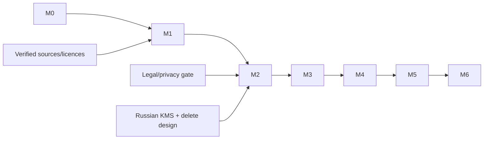

# Delivery Plan

Текущая авторизация охватывает только M0. Остальные milestones — утверждённый roadmap, не очередь
на автоматическое выполнение.

| Milestone | User outcome | Automated gate | Manual/field gate | Degradation |
|---|---|---|---|---|
| M0 Discovery | проверяемый startup package без ложных данных | `make check`, 44/44 registry validator; planned stop disabled | source/legal review pending | всё внешнее `pending` |
| M1 Offline rail map | текущий usable corridor виден offline | registry 44/44; graph/map 43 enabled; planned-stop exclusion; topology; attribution | visual corridor/source check | last valid versioned dataset |
| M2 Single rider track | пользователь видит свой local track | consent state, synthetic replay, encrypted retention | physical iOS/Android/GPS | local-only, no public confirm |
| M3 Multi-rider matching | наблюдения безопасно агрегируются | spoof/replay/independence/map ambiguity | controlled group run | estimate/unmatched <3 |
| M4 Live train view | public truth state + freshness via SSE | contract/reconnect/stale/accessibility | comprehension test | explicit stale/offline |
| M5 Delay + ETA | интервальная ETA с evidence | chronological evaluation and coverage | passenger usefulness review | schedule-only range |
| M6 Pilot | monitored privacy-safe corridor pilot | security/privacy/deletion/ops suite | field, battery, consent, incident drill | stop ingestion/read-only |

## Dependencies

## Milestone acceptance details

### M0

In: required docs/tree, 44 seed records, manifest, validators, skeletons. Out: all product logic.
Acceptance: all automated checks pass; exactly one next action; unknowns pending. Evidence:
`docs/evidence/`. Risk: sources not verified. Rollback: remove no external data because none imported.
Owner accepted M0 on 2026-07-28; this does not authorize M1–M6.

### M1

Depends on verified carrier/infrastructure/OSM sources. Acceptance: 44/44 registry slots accounted
for, 43 current stops in operational graph/map/QA, `Котляково` excluded until activation; forbidden
branches absent; ODbL visible; reproducible extract checksum. Field: source owner reviews special
stops. Rollback: serve previous versioned offline dataset.

### M2

Depends on legal/consent/KMS gates. Acceptance: one user can start/stop a synthetic/local trip;
server never publishes confirmed train; raw hard-delete/key destruction tested ≤24h. Physical
location checks required. Rollback: disable upload, retain local-only shell.

### M3

Acceptance: ≥3 independent capabilities required; replay/spoof/collusion/outlier cases cannot
produce false confirmation; parallel-track ambiguity stays unmatched. Rollback: estimates only.

### M4

Acceptance: SSE reconnect/backpressure/stale state, age/confidence through UI, accessibility and
no individual point. Rollback: REST snapshot/read-only with stale banner.

### M5

Acceptance: baseline beats schedule-only on holdout without worsening degraded cases; report
p50/p90/p95 and interval coverage. Rollback: schedule-only interval labelled estimated.

### M6

Acceptance: invite-only field evidence, deletion and incident drills, battery/crash/privacy
metrics, stop criterion. Rollback: revoke invites, stop ingestion, retain only permitted aggregate.
