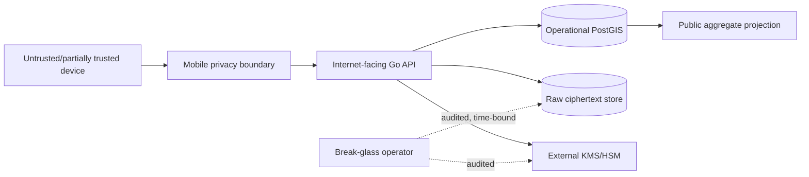

# Threat Model

## Assets

Exact location/time, trip membership, invite capability, consent state, raw encryption keys,
rail/schedule source versions, public position integrity и access audit.

## Trust boundaries

## Threats and controls

| Threat | Impact | M0 control / required control |
|---|---|---|
| GPS spoofing | false train position | state gate, plausibility, multi-capability, quarantine |
| Replay | inflated contributors | nonce/window, server receive time, rotating capability |
| Sybil/collusion | false `crowd_confirmed` | ≥3 independent capability plus anti-collusion signals |
| Wrong trip selection | aggregate contamination | schedule candidates, explicit rider confirmation, ambiguity |
| Parallel-track error | wrong route/ETA | runner-up score, uncertainty margin, no forced match |
| Stalking/inference | passenger identification | no individual API, small-cell suppression, delayed/aggregate output |
| Invite theft | unauthorized contribution | scoped expiring invite, revoke list, rate limits |
| Consent bypass | unlawful collection | server requires active grant; background separate; fail closed |
| Raw DB breach | exact track disclosure | application-layer envelope encryption, key separation, ≤24h |
| Key/backup retention | undeletable raw data | per-payload DEK destruction, backup policy gate |
| Log leakage | coordinates in observability | structured allowlist/redaction tests |
| Source poisoning | wrong graph/schedule | checksums, source versions, licence/provenance review |
| SSE abuse | scraping/DoS | future auth/capability, limits, reconnect policy; not implemented |

## Abuse cases

- Участник нажимает «Я в поезде», находясь рядом с линией: observation не становится confirmed.
- Один модифицированный клиент клонирует capability: independence score fails or state stays estimated.
- Наблюдатель пытается выбрать конкретного contributor через event timing: public projection batches
  contributors and never reveals membership changes below privacy threshold.
- Владелец пытается просмотреть raw points без incident: RBAC denies; attempted access audited.

## Security gates before real GPS

Legal/privacy review, consent UX test, KMS/residency design, delete/key-destruction integration test,
mobile permission review, API authentication/invite design, abuse simulation, log-redaction test and
incident procedure must all pass. В M0 эти gates `NOT_RUN`.
